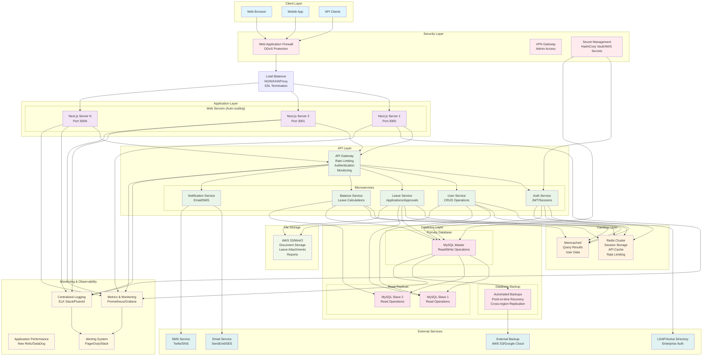

# Leave Management System - High Level Design (HLD)
## Scalable Architecture: 50 → 500 Users



## System Components Breakdown

### **1. Current Architecture (50 Users)**
```yaml
Frontend:
  - Next.js SSR/CSR Application
  - React Components with Tailwind CSS
  - Client-side routing and state management

Backend:
  - Next.js API Routes (/api/mysql/*)
  - Direct MySQL connections per request
  - JWT-based authentication
  - File-based session management

Database:
  - Single MySQL instance
  - Direct connections from API routes
  - Basic backup strategy

Infrastructure:
  - Single server deployment
  - Basic monitoring
  - Manual scaling
```

### **2. Scalable Architecture (500 Users)**

#### **A. Frontend Layer**
```yaml
Web Application:
  - Next.js with SSG/ISR for better performance
  - CDN distribution (CloudFlare/AWS CloudFront)
  - Progressive Web App (PWA) capabilities
  - Client-side caching strategies

Mobile Support:
  - Responsive design for mobile browsers
  - React Native app (future expansion)
  - API-first approach for multi-platform support
```

#### **B. Load Balancing & Reverse Proxy**
```yaml
Load Balancer:
  - NGINX or HAProxy
  - SSL/TLS termination
  - Health checks and failover
  - Geographic load distribution

Configuration:
  - Round-robin or least-connections algorithm
  - Session affinity for stateful operations
  - Rate limiting and DDoS protection
```

#### **C. Application Layer (Horizontal Scaling)**
```yaml
Multiple Next.js Instances:
  - 3-5 server instances (auto-scaling)
  - Container-based deployment (Docker)
  - Kubernetes orchestration
  - Blue-green deployment strategy

Session Management:
  - Redis-based session storage
  - Stateless application design
  - JWT with refresh tokens
```

#### **D. API Gateway & Microservices**
```yaml
API Gateway Features:
  - Request routing and load balancing
  - Authentication and authorization
  - Rate limiting per user/IP
  - API versioning and deprecation
  - Request/response transformation
  - Analytics and monitoring

Microservices Breakdown:
  - Auth Service: User authentication, JWT management
  - User Service: User CRUD, profile management
  - Leave Service: Leave applications, approvals
  - Balance Service: Leave balance calculations
  - Notification Service: Email, SMS, push notifications
```

#### **E. Caching Strategy**
```yaml
Redis Cluster:
  - Session storage (distributed sessions)
  - API response caching
  - Rate limiting counters
  - Real-time features (WebSocket support)

Memcached:
  - Database query result caching
  - User profile data caching
  - Leave balance caching
  - Computed aggregations

Application-Level Caching:
  - Next.js built-in caching
  - Static page generation
  - API route caching
  - Client-side caching
```

#### **F. Database Architecture**
```yaml
Master-Slave Configuration:
  - 1 Master (Write operations)
  - 2-3 Read Replicas (Read operations)
  - Automatic failover mechanism
  - Read/write splitting in application

Database Optimization:
  - Connection pooling (PgBouncer/MySQL Proxy)
  - Query optimization and indexing
  - Partitioning for large tables
  - Archiving old data

Backup Strategy:
  - Automated daily backups
  - Point-in-time recovery
  - Cross-region replication
  - Disaster recovery procedures
```

### **3. Performance Optimizations**

#### **A. Database Performance**
```sql
-- Indexing Strategy
CREATE INDEX idx_user_email ON users(email);
CREATE INDEX idx_leave_user_status ON leave_applications(user_id, status);
CREATE INDEX idx_leave_dates ON leave_applications(start_date, end_date);
CREATE INDEX idx_balance_user_year ON leave_balance(user_id, year);

-- Query Optimization
-- Use prepared statements
-- Implement connection pooling
-- Read replica routing for SELECT queries
-- Batch operations for bulk updates
```

#### **B. Application Performance**
```javascript
// Connection Pooling
const pool = mysql.createPool({
  connectionLimit: 20,
  host: process.env.DB_HOST,
  user: process.env.DB_USER,
  password: process.env.DB_PASSWORD,
  database: process.env.DB_NAME,
  acquireTimeout: 60000,
  timeout: 60000,
});

// Redis Caching Implementation
const cacheKey = `user_balance_${userId}_${year}`;
const cached = await redis.get(cacheKey);
if (cached) {
  return JSON.parse(cached);
}
const balance = await fetchFromDatabase(userId, year);
await redis.setex(cacheKey, 3600, JSON.stringify(balance));
```

### **4. Security Enhancements**

```yaml
Web Application Firewall (WAF):
  - SQL injection protection
  - XSS prevention
  - Rate limiting
  - DDoS mitigation

Authentication & Authorization:
  - Multi-factor authentication (MFA)
  - Role-based access control (RBAC)
  - OAuth2/SAML integration
  - API key management

Data Protection:
  - Encryption at rest (database)
  - Encryption in transit (SSL/TLS)
  - PII data anonymization
  - GDPR compliance measures

Network Security:
  - VPN access for administrators
  - Private networks for internal services
  - Security groups and firewalls
  - Regular security audits
```

### **5. Monitoring & Observability**

```yaml
Application Monitoring:
  - Real-time performance metrics
  - Error tracking and alerting
  - User activity monitoring
  - API response time tracking

Infrastructure Monitoring:
  - Server resource utilization
  - Database performance metrics
  - Network latency monitoring
  - Storage capacity tracking

Logging Strategy:
  - Centralized log aggregation
  - Structured logging (JSON)
  - Log retention policies
  - Security event logging

Alerting:
  - Critical system alerts
  - Performance threshold alerts
  - Security incident alerts
  - Business metric alerts
```

### **6. Deployment & DevOps**

```yaml
Container Strategy:
  - Docker containerization
  - Kubernetes orchestration
  - Auto-scaling policies
  - Rolling updates

CI/CD Pipeline:
  - Automated testing (unit, integration, e2e)
  - Code quality checks
  - Security scanning
  - Automated deployment

Infrastructure as Code:
  - Terraform for infrastructure
  - Ansible for configuration
  - Environment parity
  - Disaster recovery automation
```

### **7. Cost Optimization**

```yaml
Resource Management:
  - Auto-scaling based on demand
  - Spot instances for non-critical workloads
  - Reserved instances for predictable loads
  - Resource right-sizing

Performance Optimization:
  - CDN for static assets
  - Image optimization
  - Code splitting and lazy loading
  - Database query optimization
```

### **8. Migration Strategy (50 → 500 Users)**

```yaml
Phase 1: Foundation (Month 1-2)
  - Implement connection pooling
  - Add Redis for session management
  - Set up monitoring and logging
  - Database optimization

Phase 2: Scaling (Month 3-4)
  - Load balancer implementation
  - Database read replicas
  - Caching layer implementation
  - Security enhancements

Phase 3: Microservices (Month 5-6)
  - API gateway implementation
  - Service decomposition
  - Advanced monitoring
  - Performance optimization

Phase 4: High Availability (Month 7-8)
  - Multi-region deployment
  - Disaster recovery
  - Advanced security
  - Complete automation
```

This HLD provides a comprehensive roadmap for scaling your Leave Management System from 50 to 500 users while maintaining performance, security, and reliability.
